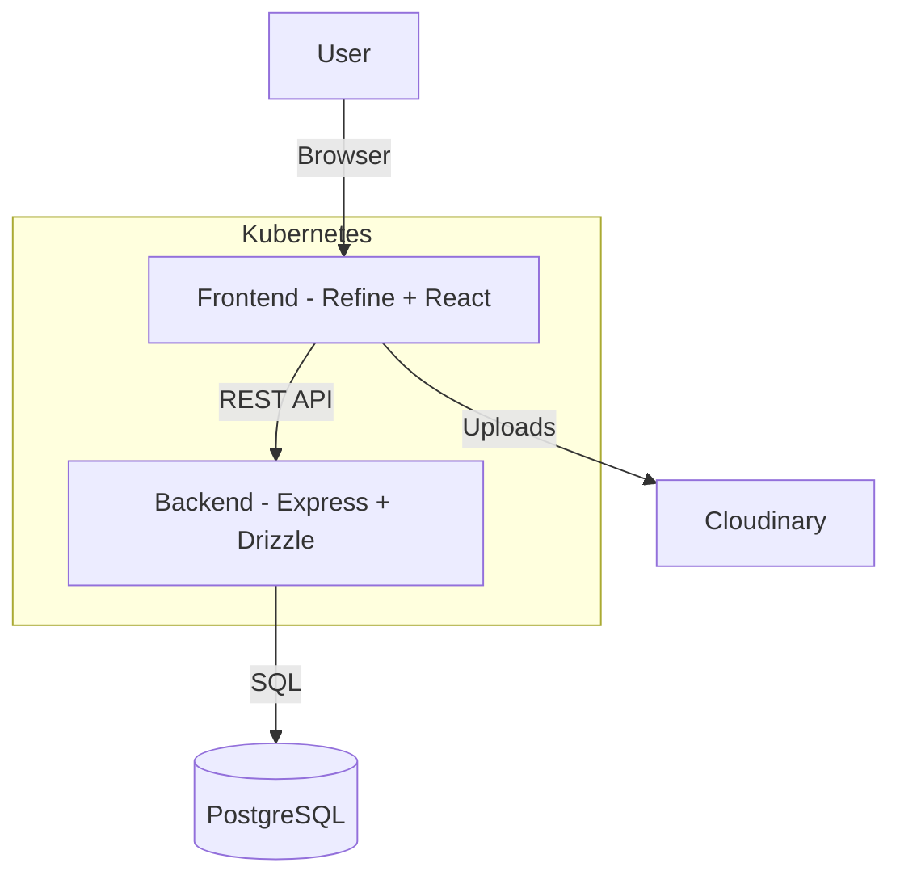

# 🎓 Classroom Management Platform

<div align="center">

**A modern, role-based classroom management system with dashboards, enrollments, and DevOps-ready deployments.**

[](classroom-frontend)
[](classroom-backend)
[](#)
[](#)
[](#devops--infrastructure)

</div>

---

## ✨ Overview

**Classroom** streamlines academic operations for **admins, teachers, and students** with a clean dashboard, role-aware workflows, and intuitive management screens for departments, subjects, classes, and enrollments.

---

## 🖼️ Screenshots

> _Login screen sample (clean, recruiter-friendly UI)._


---

## 🚀 Key Features

- ✅ **Role-based access** for Admin, Teacher, and Student.
- 📊 **Dashboard metrics** and recent activity snapshots.
- 🧩 **Modules**: Departments, Subjects, Classes, Faculty, Enrollments.
- 🔐 **Authentication** flow with secure session handling.
- ☁️ **Cloudinary-ready uploads** for profile/asset handling.
- ⚙️ **Scalable REST API** with clean resource routes.

---

## 🧱 Tech Stack

**Frontend**

- ⚛️ React 19 + Refine
- 🎨 Tailwind + shadcn/ui + Radix UI
- 📈 Recharts for analytics

**Backend**

- 🟢 Node.js + Express
- 🧬 Drizzle ORM + PostgreSQL
- 🔐 Better Auth
- 🛡️ Arcjet security middleware

---

## 🧰 DevOps & Infrastructure

This repo includes **real-world DevOps concepts** — perfect for recruiters evaluating production readiness:

- 🐳 **Dockerized services** (frontend & backend).
- 🧩 **Docker Compose** for local multi-container orchestration.
- ☸️ **Kubernetes manifests** (Deployments, Services, Ingress).
- 🛡️ **Secrets + environment config** patterns.
- 📦 **Static frontend served via Nginx**.

---

### 🏗️ Architecture (High-Level)

This project implements a complete DevOps lifecycle.

### ☁️ Cloud Infrastructure

The Kubernetes cluster runs on an Azure VM using k3s.

- Azure Virtual Machine (Ubuntu 22.04)
- k3s lightweight Kubernetes
- Public NodePort exposure
- GitHub Actions deployment


### **CI/CD Pipeline**

Automated workflows using **GitHub Actions**:

1.  **Docker Build**: On push to `main`, Docker images for Frontend and Backend are built.
2.  **Push to Registry**: Images are tagged with the commit SHA and pushed to Docker Hub (`vanshsuri07/classroom-*`).
3.  **Deploy to K8s**: The manifest files are updated with the new image tags, and `kubectl` commands apply the changes to the cluster.


### **Kubernetes Cluster**

The application runs on a Kubernetes cluster with the following components:

- **Ingress Controller**: Routes traffic to Backend (`/api`) and Frontend (`/`).
- **Services**: `LoadBalancer` for Backend, `NodePort` for Frontend (Internal communication).
- **Deployments**: Scalable pods for both services with health checks (Liveness/Readiness probes).
- **Secrets**: Secure management of credentials (DB URL, API Keys).




---

## 📂 Project Structure

```
classroom/
├── classroom-frontend/   # UI + dashboard
├── classroom-backend/    # API + auth + database
├── k8s/                  # Kubernetes manifests
├── docker-compose.yml    # Local dev orchestration
└── Readme.md             # This file
```

---

## 🔧 Environment Variables

### Frontend (`classroom-frontend/.env`)

```
VITE_BACKEND_BASE_URL=http://localhost:8000/api/
VITE_CLOUDINARY_UPLOAD_URL=<cloudinary_url>
VITE_CLOUDINARY_CLOUD_NAME=<cloud_name>
VITE_CLOUDINARY_UPLOAD_PRESET=<preset>
```

### Backend (`classroom-backend/.env`)

```
DATABASE_URL=postgres://...
FRONTEND_URL=http://localhost:3000
BETTER_AUTH_SECRET=your_secret
ARCJET_KEY=your_arcjet_key
ARCJET_ENV=development
```

---

## ▶️ Run Locally

### 1) Frontend

```bash
cd classroom-frontend
pnpm install
pnpm dev
```

### 2) Backend

```bash
cd classroom-backend
pnpm install
pnpm dev
```

---

## 🐳 Run with Docker Compose

```bash
docker compose up --build
```

---

## 🎡 Deployment

### Kubernetes Deployment

Ensure you have `kubectl` configured and pointing to your cluster.

1.  **Apply Secrets**:

    ```bash
    kubectl create secret generic backend-secrets --from-literal=DATABASE_URL=<your_db_url>
    ```

2.  **Deploy Resources**:

    ```bash
    kubectl apply -f k8s/backend.yml
    kubectl apply -f k8s/frontend.yml
    kubectl apply -f k8s/ingress.yml
    ```

3.  **Access the App**:
    Add `127.0.0.1 classroom.local` to your `/etc/hosts` file (if running locally/minikube) to access via ingress.

---

## 🧠 Production Notes

- Images are tagged using Git commit SHA
- Rolling updates handled by Kubernetes Deployments
- Secrets injected via Kubernetes Secret objects
- Backend supports graceful shutdown (SIGTERM)
- CI/CD deploys without SSH access

---

## 📬 Contact

If you'd like a live demo or walkthrough, reach out!

---

⭐ **If this project helped you, please star the repo!**
